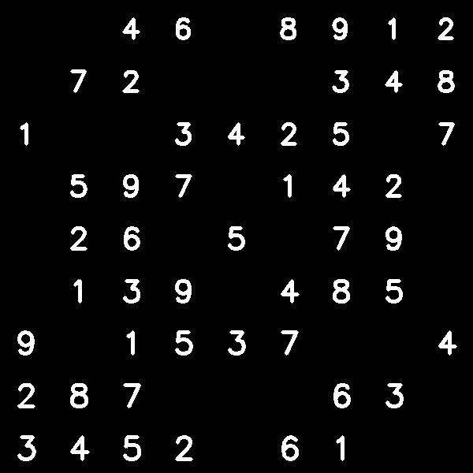

# ARSudokuSolver
Augmented Reality Sudokusolver with OpenCV 

## Setup:
1) Install Python >= 3.8
2) Install requirements
```
$pip install -r requirements.txt 
```

## Workflow:


First the input image gets overlapped with a gaussioan blur, denoised and thresholded:


Next edges get detected with the canny edge detector


From the edges the contours get calculated


The biggest contour get selected and the corners get calculated


From the calculated corners the Homographie gets calculated and the image gets warped. Again the edges with canny edgedetection get detected.


Next the contours get again detected and with a aspectratio check all the numbers get detected and a boundingbox around them get calculated for extraction and classification.


Also the positions of the gridcells get calculated


Next from each number the HOG descriptor gets calculated and with a SVM the numbers get classified. With this information the grid is stored as an array and solved with a Sudoku solver based on backtracking. The resulting sudoku gets written to an image a the cell positions calculated before



This numbers get warped again with the inverse Homographie


In the last step the original image and the warped sudoku solution get overlapped


## Run script for images:
Run the main script:
```
$python main.py 1 --path=<path_to_image>
```
For help run:
```
$python main.py -h
```

You can change the number size with the fsd (font scale divisor) as follows:
```
$python main.py 1 --path=<path_to_image> --fsd=3.0 
```

If not all numbers get detected correctly you can try to deskew them while detecting as follows:
```
$python main.py 1 --path=<path_to_image> --fsd=3.0 --deskew=True
```

You can look at the debug images as follows:
```
$python main.py 1 --path=<path_to_image> --fsd=3.0 --deskew=True --debug=True
```

## Run script on webcam:
Run the main script:
```
$python main.py 0
```

For help run:
```
$python main.py -h
```

You can change the number size with the fsd (font scale divisor) as follows:
```
$python main.py 1 --path=<path_to_image> --fsd=3.0 
```

If not all numbers get detected correctly you can try to deskew them while detecting as follows:
```
$python main.py 1 --path=<path_to_image> --fsd=3.0 --deskew=True
```
 
